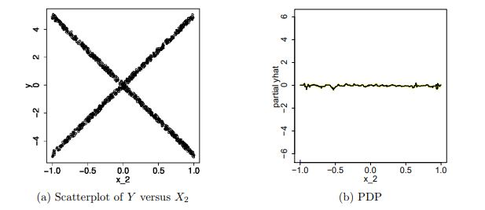

```{r setup, include=FALSE}
knitr::opts_chunk$set(echo = FALSE)
```

## CHRW Data Science

- Small group, focused on rapid prototyping
- Many ideas will "die on the vine"
- Need to interface with domain experts (reps at the desk, pricing managers, etc.) often to gain insights
- Need for code that can be quickly moved from notebook -> prototype -> production

## Why R?

- Most of us are Statisticians/Mathematicians by trade => package availability
- Tools for Exploratory Data Analysis
- Concise
- Extremely good at handling tabular data (`data.table`!)
- Connectors exist for commonly used databases in prototyping (Redis, Mongo, etc.)

## Tools 

### Understanding Data + Model Building
- `GGally` 
- `trelliscopejs`
- `XGBoost` + `PDP`

### Prototyping
- docker 
- docker-compose
- `plumber`

## Freidman's Partial Dependence Function

For a given model $\hat{f}$, we want to know roughly the effect of each of the covariates on the output of $\hat{f}$.

The simplest way we can do this is 

\[
\begin{eqnarray}
\hat{f_k}(x_k) & = &
\mathbb{E}_{X_1,\ldots\hat{X_k}, \ldots{X_p}}(\hat{f}(x_1, \ldots, x_k, \ldots, x_p))\\ & = & 
\int_{X_1, \ldots, \hat{X_k}, \ldots, X_p}\hat{f}(x_1, \ldots, x_k, \ldots, x_p) \mbox{d}\mu(x_1, \ldots, \hat{x_k}, \ldots, x_p) \\
& \approx & \frac{1}{N}\sum_{l=1}^N f(x_{1_l}, \ldots, x_k, \ldots, x_{p_l})
\end{eqnarray}
\]

where this last sum is taken over the training data.


## ICE Plots

The trouble with the previous example is that interactions can be "washed out". Consider the following (due to Goldstein, et al)

\[
Y = .2X_1 - 5X_2 + 10X_2\mathbb{I}[X_3 \geq 0] + \epsilon \\
\epsilon \backsim N(0, 1); \  X_1, X_2, X_3 \backsim Unif(-1, 1) 
\]

Idea: Don't do averaging!

## ICE Plots



